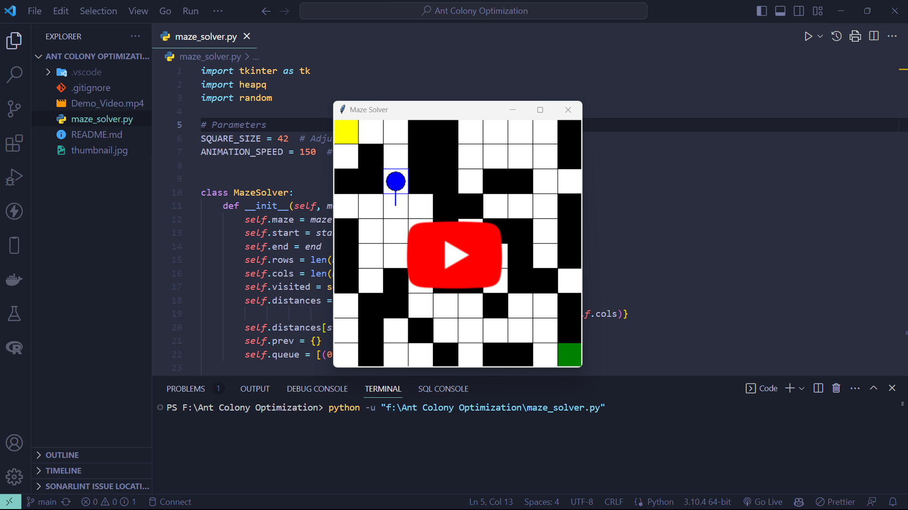
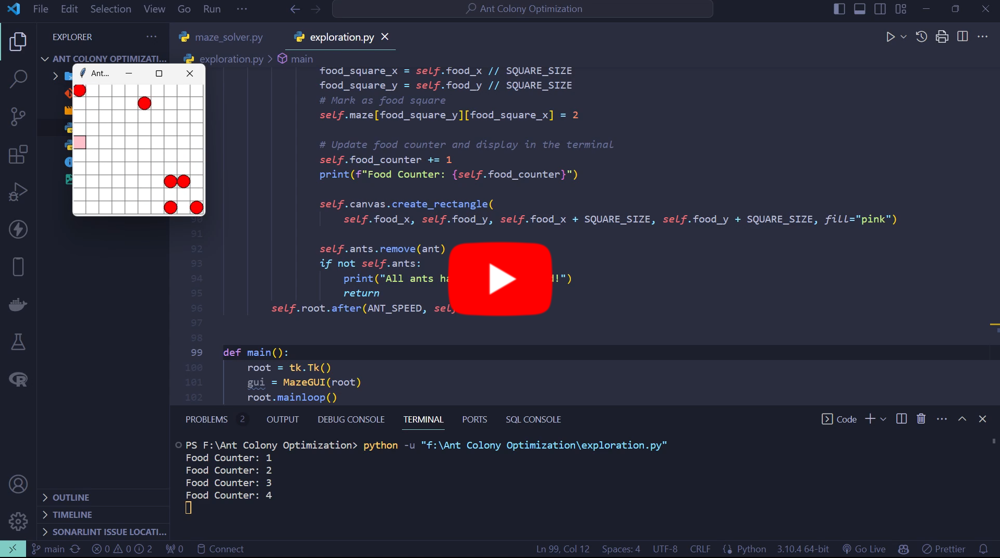

# Maze Solver using Ant Colony Optimization

This is a maze solving visualization tool implemented in Python using the Tkinter library for the GUI. The program generates a random maze and uses Dijkstra's algorithm to find the shortest path from the start to the end of the maze.

## Features

- Generates a random maze with a customizable size.
- Visualizes the maze using a graphical interface built with Tkinter.
- Utilizes Dijkstra's algorithm to find the shortest path.
- Animates the solving process, showing the progress of the algorithm step by step.

## Demonstration Video

Click on the thumbnail below to watch the demonstration video on YouTube.

[](https://youtu.be/2zzawIr0w3o?si=BhZQZS0olTEq26wu)
[](https://youtu.be/9SMyAWiDNkQ)

## Prerequisites

- Python 3.x
- Tkinter (usually comes pre-installed with Python)
- heapq (for priority queue in MazeSolver)

## Usage

1. Clone the repository using:

   ```bash
   git clone <repo-url>
   ```

2. Navigate to the directory using:

   ```bash
    cd <repo-name>
   ```

3. Run the program using:

   ```bash
   py maze.py
   ```

4. Adjust the maze_size list in `maze_solver.py` to change the size of the mazes

5. After the current maze is solved, click on the close 'X' button to generate the next maze

## Customization

You can customize the behavior and appearance of the maze solver in the `maze_solver.py` file. Some parameters you might want to adjust:

- **square_size**: Determines the size of each square in the GUI.
- **animation_speed**: Adjusts the speed of the animation during pathfinding.
- **maze_sizes**: List of maze sizes to run the solver with.
